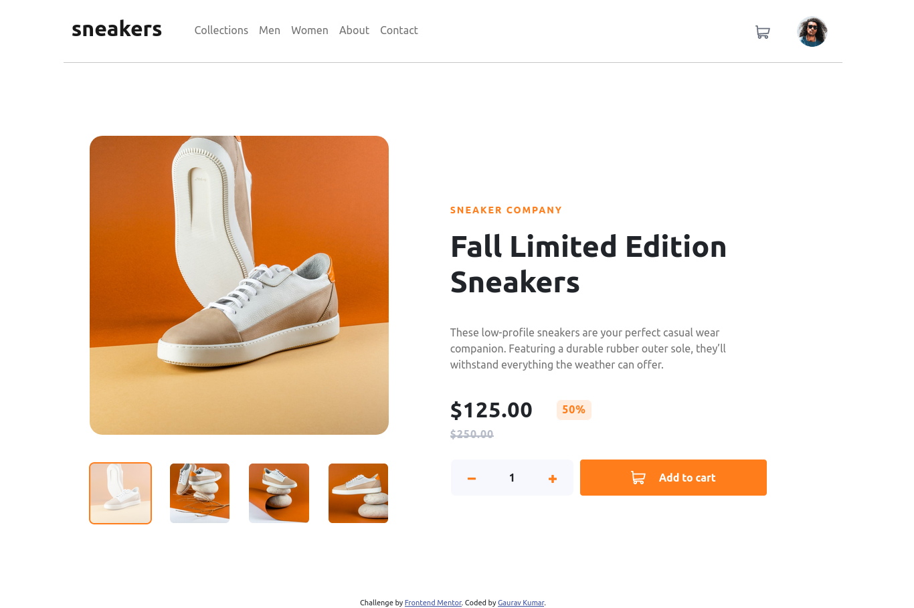
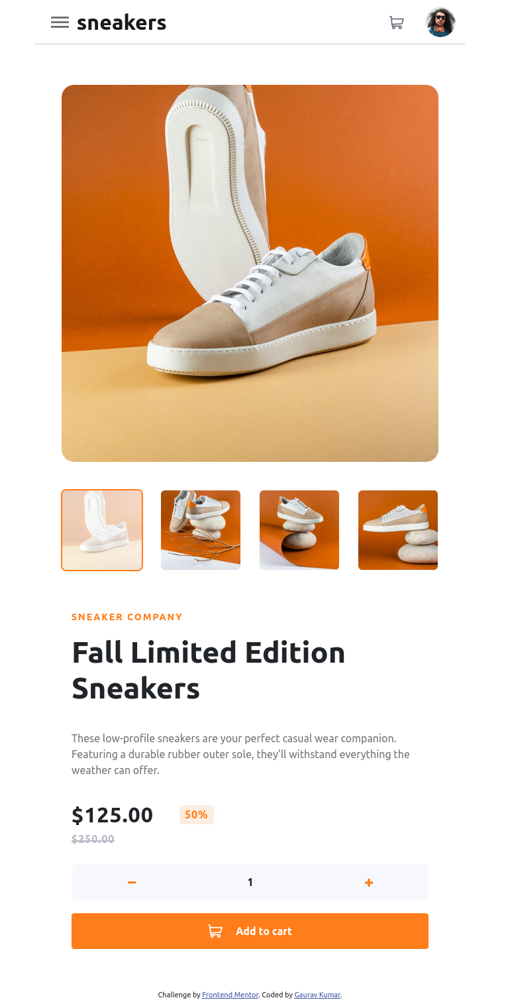
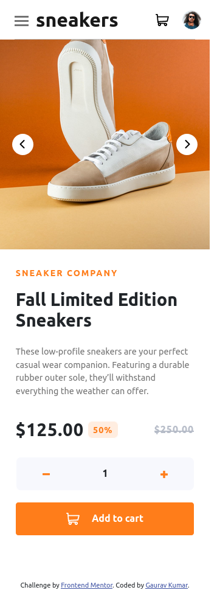

# Frontend Mentor - E-commerce product page solution

This is a solution to the [E-commerce product page challenge on Frontend Mentor](https://www.frontendmentor.io/challenges/ecommerce-product-page-UPsZ9MJp6). Frontend Mentor challenges help you improve your coding skills by building realistic projects.

## Table of contents

- [Overview](#overview)
  - [The challenge](#the-challenge)
  - [Screenshot](#screenshot)
  - [Links](#links)
- [My process](#my-process)
  - [Built with](#built-with)
  - [What I learned](#what-i-learned)
  - [Continued development](#continued-development)
  - [Useful resources](#useful-resources)
- [Author](#author)
- [Acknowledgments](#acknowledgments)

## Overview

### The challenge

Users should be able to:

- View the optimal layout for the site depending on their device's screen size
- See hover states for all interactive elements on the page
- Open a lightbox gallery by clicking on the large product image
- Switch the large product image by clicking on the small thumbnail images
- Add items to the cart
- View the cart and remove items from it

### Screenshot





### Links

- Solution URL: [Add solution URL here](https://your-solution-url.com)
- Live Site URL: [Add live site URL here](https://your-live-site-url.com)

## My process

### Built with

- Semantic HTML5 markup
- SCSS
- Flexbox
- CSS Grid
- Desktop-first workflow
- [Bootstrap 5](https://getbootstrap.com/) - For styles
- [JQuery](https://jquery.com/)

### What I learned

A lot more comfortability working with CSS Grids, SCSS and JQuery. Practice is the key guys so keep grinding.

```html
<!--For the first time, I get familier with writing custom attributes. That made interacting with DOM pretty straight forward with adding any unnecessary classes or ids. Pretty awesome. -->

```

### Continued development

- Responsive Design: Still I need a lot of action in designing responsive webpages. That was tha toughest task for me.
- Scalability: This was just for a single product and still took me a lot more time to get around this. So definitely needs to work on this issue.

### Useful resources

- [CSS Shadows](https://getcssscan.com/css-box-shadow-examples) - This helped me to create beautiful box shadows. I really liked this pattern and will use it going forward.

## Author

- Website - [Gaurav Kumar](https://www.your-site.com)
- Frontend Mentor - [@yourusername](https://www.frontendmentor.io/profile/yourusername)
- Twitter - [@yourusername](https://www.twitter.com/yourusername)

## Acknowledgments

Thank you StackOverflow and Google and Codepen for your constant support and direction, Frontend mentor for this awesome challenge and myself for not quitting, which I rarely do. In the end, I just wanna quote some lines which I live by and will continue to do so <i>" Don't ever, for any reason, do anything to anyone for any reason ever, no matter what, no matter where, or who, or who you are with, or where you are going, or where you've been... ever, for any reason whatsoever... "</i>
